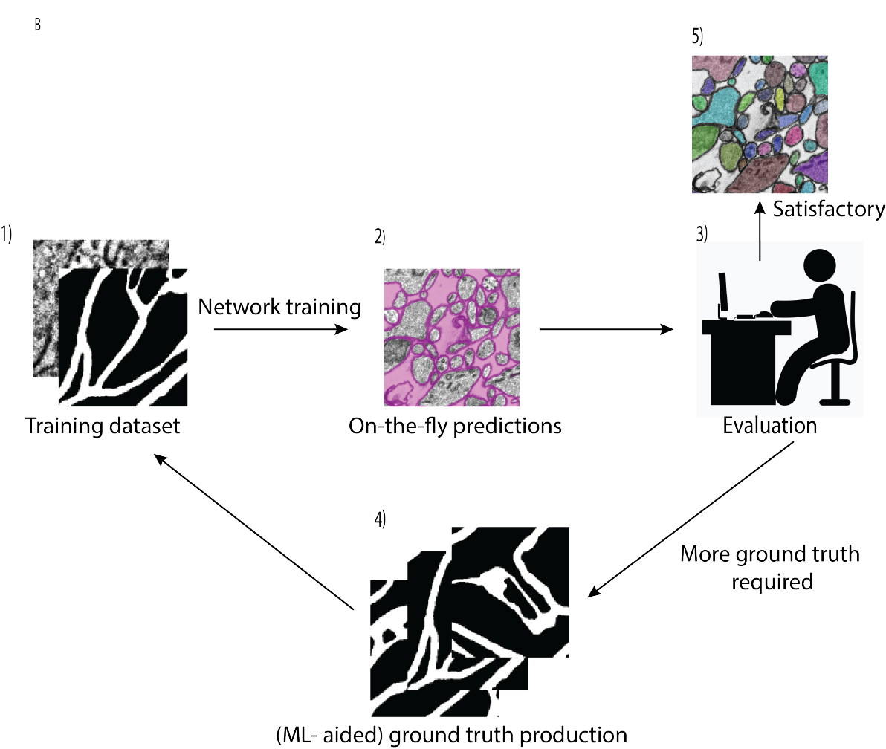
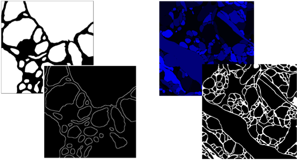
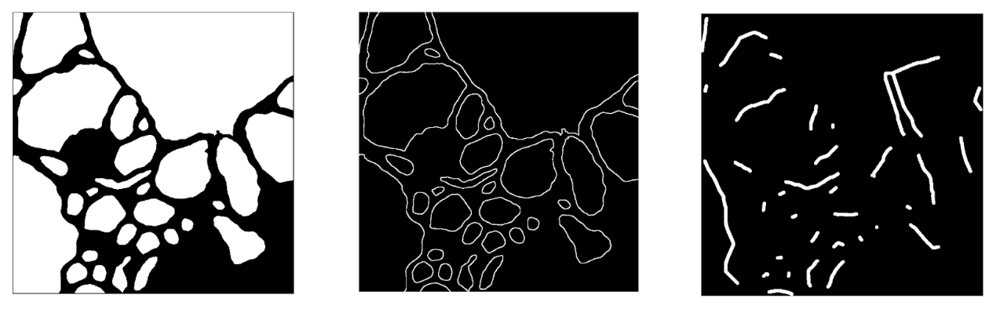

# Welcome to mEMbrain!

mEMbrain is an interactive MATLAB-based software which wraps algorithms and functions that enable labeling and segmentation of electron microscopy (EM) datasets in a user-friendly interface compatible with Linux and Windows. Though this software has mainly been used on EM datasets, it may prove useful on other image modalities, such as light microscopy images. Through its integration as an API to the volume annotation and segmentation tool VAST, mEMbrain encompasses functions for ground truth generation, image preprocessing, training of deep neural networks, and on-the-fly predictions for proofreading and evaluation. The two goals of mEMbrain are to expedite manual pixel-level labeling efforts and to harness MATLAB users with an array of semi-automatic approaches for instance segmentation. 

## Requirements

mEmbrain’s installation is straightforward and limited to a folder download. We ask the users to first make sure they have MATLAB installed on the computer they intend to use mEMbrain on. In particular, the users should make sure to have installed with MATLAB also the Computer Vision Toolbox, the Deep Learning Toolbox and the Parallel Computing Toolbox, and agree to install whatever dependencies these may have. Done from scratch, MATLAB's installation could take up to 30 minutes (often less). 

## Installation

To install mEMbrain, it is sufficient to download mEMbrain's package from this github page. To get started with mEMbrain, it is sufficient to double click on the mEMbrain_GUI.mlapp file; this will launch one of mEMbrain's main user interfaces which collects dataset generation and preprocessing, network training and prediction from VAST. 

## Workflow

*mEMbrain_GUI.mlapp* is the main mEMbrain user interface, and it gathers the main steps used in mEMbrain’s workflow. Although any of mEMbrain’s functions can be used separately, its strength derives from creating an iterative workflow that works synergically with VAST (for more information about VAST, we ask the user to visit https://lichtman.rc.fas.harvard.edu/vast/). The typical user scenario is depicted in the following figure. 

## Dataset Generation

Once the user creates some ground truth (i.e. a set of EM images with corresponding labels, perhaps created in VAST or an analogous annotation tool), they can quickly create a dataset made of patches extracted from such images. The labels can either be such that all the neurites have the same ID (i.e. color), or such that each neurite has an individual ID. mEMbrain can handle both. In general, the user is free to label any structure of their interest, mEMbrain offers a couple of transformations to prepare ground truth in a format useful for training purposes. Further, users may label “irregular” areas of ground truth (i.e. it needn’t be a fully saturated square patch, on the contrary it may contain unlabeled spaces and be of any dimension desired - while remembering that the training dataset for the neural network will be extracted from such ground truth).

In order for the labeled images to be prepared for training a membrane prediction network, they have to be transformed into images that have membrane pixels in one color, and neuropil pixels in another. For this, the user should use the **neuron_to_membrane** tab. 

If the user were to train and use  a network that predicts skeletons of neural processes, then they should use the **membrane_to_skeleton** tab to transform the neural labels into the right format.

Thus, from an original label image, the user will end up with either a membrane (typical) or a skeleton version of the original input. 

Once labels have been converted to the appropriate format, they are ready to be patched, together with their corresponding EM images. For this operation, we recommend using the patch_generation tab.

The user will be asked to provide the folder with the EM images, the labels, and the target folders where the respective patches will be saved. Further, the user needs to specify the dimension of the patches, noting that this will define the input size of the network that will be trained. If these patches are to be added to an existing dataset, the user should make sure that the patch dimensions are in agreement, or else there will be errors raised in the training phase. 

The user must also input the density of patches to be extracted from the labels. This allows the user to have the flexibility to establish how much representation a batch of labels have in the dataset. It is to be noted that if the density is too high, then the user might run into overfitting to the anatomy specific to the training dataset. A typical density might be between 100/1000 images/megapixel. Dataset augmentation techniques (such as random rotation, image flipping, gaussian blurring, motion blurring and histogram equalizer) are implemented at the time of dataset generation.

To start with the training process, the user should access the **train_a_network** tab, where they can select the folder where their patches have been saved, and choose the network to train. This network can either be a pretrained one (in which one continues learning on new parts of the dataset) or a new untrained network (if using the default option, this will be a U-net). The user will also be able to save the network once trained, such that it can then be used for prediction or continual learning. 

In this same tab, the user has the option to test different hyperparameter combinations within the advanced settings panel. A very brief explanation of such options is provided in the supplementary material. 

Once training, there will be updates on the progress printed in MATLAB’s command window. When finalized, there will be a log file of the training and its details saved together with the network. 

It should be noted that once trained, the network will work best when predicting images of the same resolution (i.e. mip level) as the resolution of the ground truth it was trained on. Hence, the user should take care of having ground truth of the same resolution, make sure that the continual learnings happen on datasets of the same resolution (or the performance will degrade).

To very briefly sample the goodness of the trained network, one can load a test image in the **evaluate_a_network** tab and evaluate qualitatively the network’s performance. If the network is good enough, the user might want to proceed on predicting onto larger portions of the EM volume opened in VAST. However, if the predictions of the network are not sufficiently good, then the user can resort to generating more ground truth and furthering the training of the network in an iterative fashion, until the network’s performance is satisfactory. 

Powerfully, mEMbrain can communicate directly with VAST and predict on the EM volumes open in the segmentation software. The user can specify if they want to predict over the entire EM volume, or if they wish to predict only in certain areas of interest, which can be contiguous and delimited by VAST coordinates, or sparse throughout the volume and marked by VAST skeletons. 

To connect to VAST, the user should click on the “connect to VAST” button, and navigate to the VASTcontrolCLASS file on their computer. 
Further, from vast they should connect to API and report the same port number on this window into the appropriate mEMbrain field. 

The output predictions will be saved in the folders specified by the user, and a vsvi file will be created such that the predictions can be dragged and dropped in VAST. 

The user should use for prediction the same mip level that was used at training time, which derives from the ground truth resolution.

Finally, predictions may be made editable in VAST, an option that could prove useful if one wants to accelerate ground truth production by swiftly correcting the predictions when faulty. 

Our hope is that this software allows for a more rapid iteration between ground truth generation, segmentation and neural reconstruction, which can be improved iteratively until satisfactory for the user’s scientific purpose. 